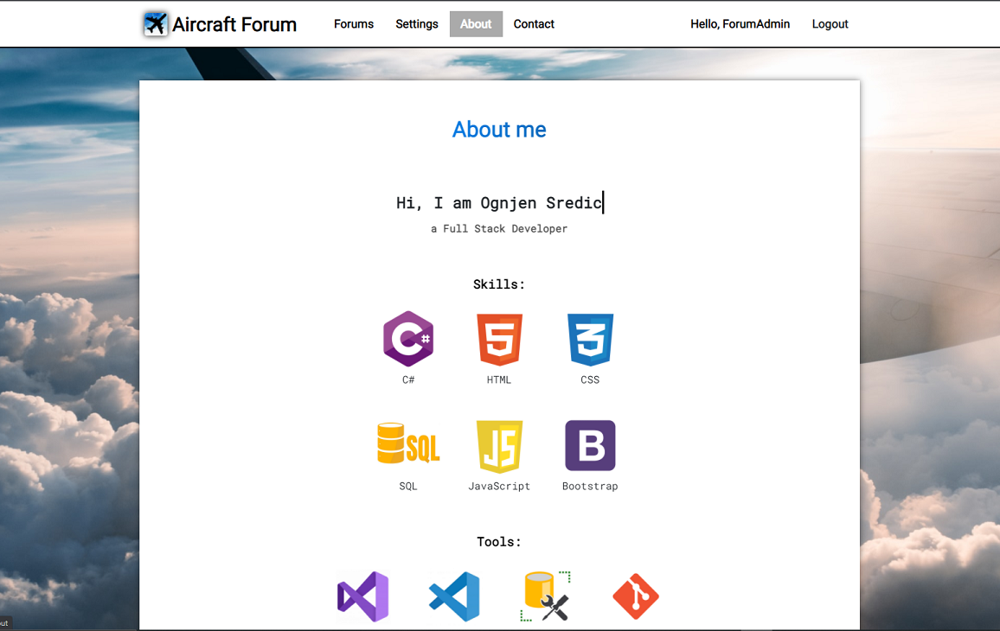
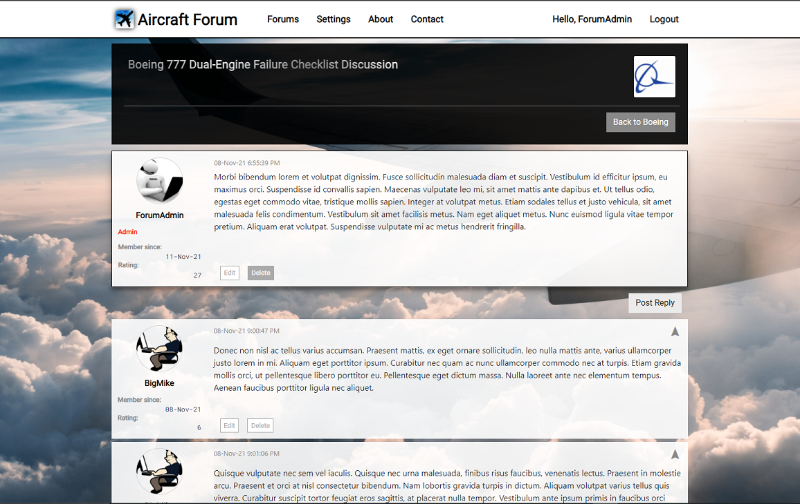

# Aircraft Forum

The website has been created as an ASP .NET Core 3.1 MVC Application, and it has been built from scratch. It's a fully functional forum with these features:
 - Separated layers: Models, Data, Services, Controllers, Views
 - Customized "Individual user accounts" Authentication
 - Authorization
 - Both server-side and client-side validations
 - CRUD operations on topics, posts and post replies
 - Search functionality for the entire forum or a specific topic
 - User profile (managing accounts)
 - Contact page
 - Styled with CSS and a bit of JS
 - Responsive website

The SQL database has been hosted on Azure. Azure Blob Storage has been used for storing all uploaded pictures.

## Database UML diagram

<div style="text-align: center;">
    
</div>

## Screenshots

<div>
	
	
</div>
<div>
	
	
</div>
<div>
	
	
</div>
<div>
	
	
</div>
<div>
	
	
</div>

Some of the things that will be implemented in the near future:
 - Tooltips
 - Paging on post pages
 - User to user private messaging
 - User signature
 - Ability to format text and add links and images to posts and replies (for now it's text-only)

As a user, after registering and logging into the website, you are able create/edit posts and reply to existing posts. You can visit your profile page, edit your information and change the profile picture.
As an administrator you can create/edit forums(topics), create/edit/delete your own posts, edit/delete users' posts and post replies, browse the list of all users and edit their profiles.

Please note that, because of security reasons, some information (mostly passwords) have been removed from the code:

`ContactController.cs`
```csharp
client.Credentials = new NetworkCredential("{your_gmail}", "{your_password}");
```

`appsettings.Production.json`
```csharp
{
"ConnectionStrings": {
"WebProjectAircraftForumDbContextConnection": "Server=tcp:aircraftforum.database.windows.net,1433;
                                               Initial Catalog=WebProjectAircraftForum.Production;
                                               Persist Security Info=False;
                                               User ID={USERNAME};Password={PASSWORD};
                                               MultipleActiveResultSets=False;Encrypt=True;TrustServerCertificate=False;Connection Timeout=30;"
    }
}
```

`DataSeeder.cs`
```csharp
var hasher = new PasswordHasher&lt;ApplicationUser&gt;();
var hashedPassword = hasher.HashPassword(user, "{admin_password}");
user.PasswordHash = hashedPassword;
```

`storageSettings.json`
```csharp
{
    "ConnectionStrings": {
    "AzureStorageAccount": "DefaultEndpointsProtocol=https;AccountName=aircraftforum;AccountKey={ACCESSKEY};EndpointSuffix=core.windows.net"
    }
}
```


